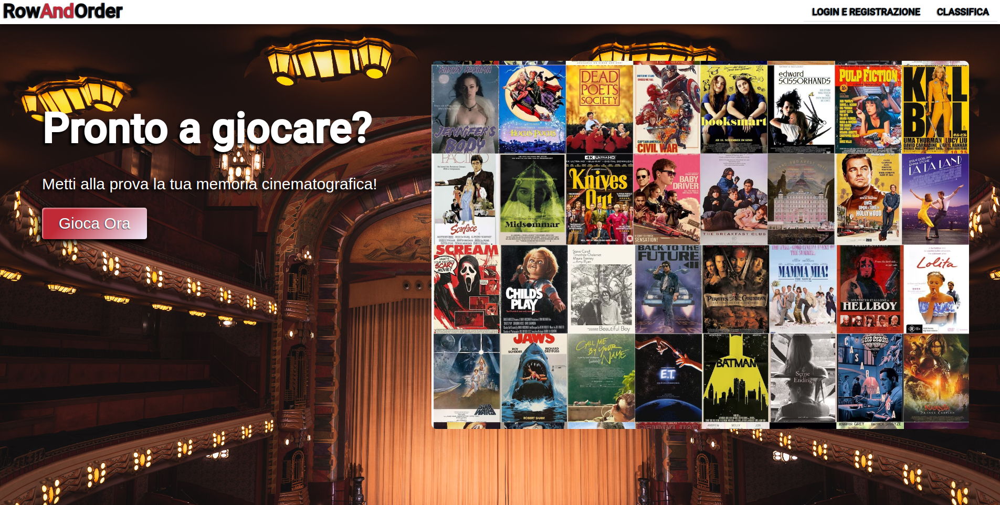
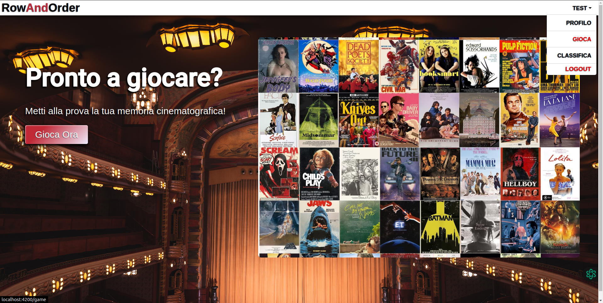
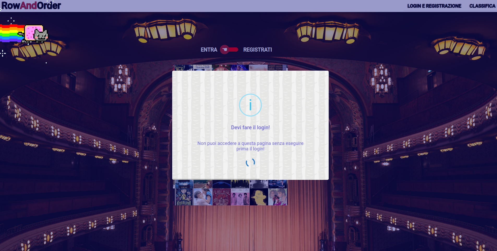
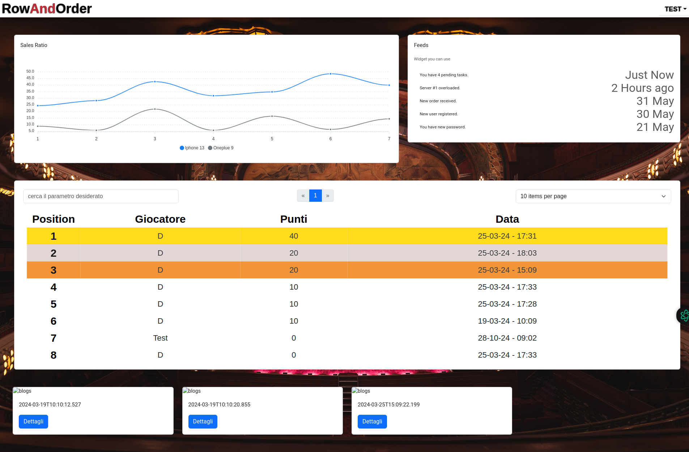
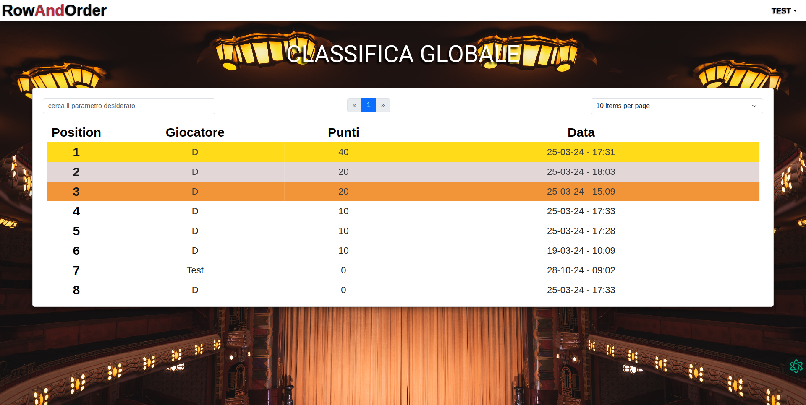

# Microgames

**Version:** 0.0.1

**Microgames** is a project designed to provide an interactive and responsive online gaming experience. The application leverages a variety of design components to offer an intuitive user interface and a sleek layout. Additionally, the application is deployed via Firebase and Heroku to ensure stability and high performance.

## 📸 Project Overview

> **Add screenshots or videos here** to give users a visual overview of the application. You might include images of the main screens, gameplay interfaces, or visual data charts.

### 🏠 HomePage 

  - Homepage with navigation links, game categories, and rankings page

### 🔑 Login/Register Page

  - Alert component in action redirecting to the login/register page if not logged in

  - This is the page you'll see when you're logged in

### ⚠️ Alerts

  - Alert sample component in action redirecting to the login/register page if not logged in

### 👤 Profile Page

  - Work in progress - this page will show user's details and stats and it will have some more features showed in the game page section

### 📊 Rankings Page

  - Work in progress - this page will show the global rankings, divided into categories (like "Most Played", "Most Won", "Most Lost"). It will also include sections for user rankings, global rankings, and more.

### 🎮 Game Page

  - Work in Progress - This page will showcase a simple game where you have to arrange films using a drag-and-drop system in the correct order, following the instructions provided by the top message in-game.
    In the future, I will add a loser and a winner page once the rewards system is implemented. Additionally, a timer will be introduced to make the game more challenging. To increase the difficulty, the film cards will move away from the user if they are grabbed and not released within one second.
